# Diagram Encji - AdventureWorks Database

## Przegląd

Baza danych AdventureWorks składa się z kilku głównych modułów biznesowych:

- **Person** - Dane o osobach, firmach i adresach
- **Sales** - Sprzedaż, klienci i zamówienia
- **Production** - Produkty, materiały i dokumentacja
- **Purchasing** - Zakupy i dostawcy
- **HumanResources** - Pracownicy, departamenty i wynagrodzenia

## Diagram ERD

```mermaid
erDiagram
    BUSINESSENTITY ||--o{ PERSON : "PersonID"
    BUSINESSENTITY ||--o{ EMPLOYEE : "BusinessEntityID"
    BUSINESSENTITY ||--o{ STORE : "StoreID"
    BUSINESSENTITY ||--o{ VENDOR : "VendorID"
    BUSINESSENTITY ||--o{ BUSINESSENTITYADDRESS : "AddressID"
    BUSINESSENTITY ||--o{ BUSINESSENTITYCONTACT : "ContactTypeID"
    
    BUSINESSENTITYADDRESS }o--|| ADDRESS : ""
    BUSINESSENTITYADDRESS }o--|| ADDRESSTYPE : ""
    
    ADDRESS }o--|| STATEPROVINECE : ""
    STATEPROVINECE }o--|| COUNTRYREGION : ""
    
    PERSON ||--o{ EMAILADDRESS : ""
    PERSON ||--o{ PHONE : ""
    PERSON ||--o{ PASSWORD : ""
    PERSON ||--o{ BUSINESSENTITYCONTACT : ""
    
    BUSINESSENTITYCONTACT }o--|| CONTACTTYPE : ""
    
    EMPLOYEE }o--|| DEPARTMENT : ""
    EMPLOYEE ||--o{ EMPLOYEEDEPARTMENTHISTORY : ""
    EMPLOYEE ||--o{ EMPLOYEEPAYHISTORY : ""
    EMPLOYEE ||--o{ JOBCANDIDATE : ""
    
    EMPLOYEEDEPARTMENTHISTORY }o--|| SHIFT : ""
    
    DEPARTMENT ||--o{ DEPARTMENTGROUP : ""
    
    CUSTOMER }o--|| PERSON : ""
    CUSTOMER }o--|| STORE : ""
    CUSTOMER }o--|| TERRITORY : ""
    
    STORE }o--|| SALESPERSON : ""
    
    PRODUCT ||--o{ PRODUCTCATEGORY : ""
    PRODUCT ||--o{ PRODUCTSUBCATEGORY : ""
    PRODUCT ||--o{ PRODUCTMODEL : ""
    PRODUCT ||--o{ UNITOFMEASURE : ""
    PRODUCT ||--o{ SUPPLIER : ""
    
    BILLOFMATERIALS }o--|| PRODUCT : "ProductAssemblyID"
    BILLOFMATERIALS }o--|| PRODUCT : "ComponentID"
    BILLOFMATERIALS }o--|| UNITOFMEASURE : ""
    
    PRODUCTMODEL ||--o{ ILLUSTRATION : ""
    
    DOCUMENT }o--|| EMPLOYEE : "Owner"
    
    SALESORDERHEADER }o--|| CUSTOMER : ""
    SALESORDERHEADER }o--|| ADDRESS : "BillToAddressID"
    SALESORDERHEADER }o--|| ADDRESS : "ShipToAddressID"
    SALESORDERHEADER }o--|| SALESPERSON : ""
    SALESORDERHEADER }o--|| TERRITORY : ""
    SALESORDERHEADER }o--|| SHIPMETHODS : ""
    SALESORDERHEADER }o--|| CREDITCARD : ""
    
    SALESORDERDETAIL }o--|| SALESORDERHEADER : ""
    SALESORDERDETAIL }o--|| PRODUCT : ""
    
    PURCHASEORDERHEADER }o--|| VENDOR : ""
    PURCHASEORDERHEADER }o--|| EMPLOYEE : ""
    PURCHASEORDERHEADER }o--|| SHIPMETHODS : ""
    
    PURCHASEORDERDETAIL }o--|| PURCHASEORDERHEADER : ""
    PURCHASEORDERDETAIL }o--|| PRODUCT : ""
    
    PRODUCTINVENTORY }o--|| PRODUCT : ""
    PRODUCTINVENTORY }o--|| LOCATION : ""
    
    TRANSACTIONHISTORY }o--|| PRODUCT : ""
    TRANSACTIONHISTORY }o--|| TRANSACTION : ""
    
    VENDOR ||--o{ PRODUCTVENDOR : ""
    PRODUCT ||--o{ PRODUCTVENDOR : ""
    PRODUCTVENDOR }o--|| VENDOR : ""
    
    SALESORDERHEADER ||--o{ SALESREASON : ""
    
    COUNTRYREGION ||--o{ COUNTRYREGIONCURRENCY : ""
    CURRENCY ||--o{ COUNTRYREGIONCURRENCY : ""
    
    CURRENCY ||--o{ CURRENCYRATE : "FromCurrencyCode"
    CURRENCY ||--o{ CURRENCYRATE : "ToCurrencyCode"
    
    PRODUCTMODEL ||--o{ PRODUCTMODELILLUSTRATION : ""
    ILLUSTRATION ||--o{ PRODUCTMODELILLUSTRATION : ""
    PRODUCT ||--o{ PRODUCTMODELILLUSTRATION : ""
    
    CULTURE ||--o{ PRODUCTMODELDESCRIPTION : ""
    PRODUCTMODEL ||--o{ PRODUCTMODELDESCRIPTION : ""
```

## Schemat bazy danych - Tabele główne

### Person (Osób i kontakty)
- **BusinessEntity** - Główna encja biznesowa
- **Person** - Dane o osobach
- **Address** - Adresy
- **AddressType** - Typy adresów
- **StateProvince** - Stany/Prowincje
- **CountryRegion** - Kraje/Regiony
- **EmailAddress** - Adresy email
- **Phone** - Numery telefonów
- **Password** - Hasła użytkowników

### Sales (Sprzedaż)
- **Customer** - Klienci
- **SalesOrderHeader** - Nagłówki zamówień sprzedaży
- **SalesOrderDetail** - Szczegóły zamówień
- **SalesReason** - Przyczyny sprzedaży
- **SalesPerson** - Pracownicy sprzedaży
- **Territory** - Terytoria sprzedażowe
- **ShipMethod** - Metody wysyłki
- **CreditCard** - Karty kredytowe
- **Currency** - Waluty
- **CurrencyRate** - Kursy walut
- **CountryRegionCurrency** - Waluty w krajach

### Production (Produkcja)
- **Product** - Produkty
- **ProductCategory** - Kategorie produktów
- **ProductSubcategory** - Podkategorie produktów
- **ProductModel** - Modele produktów
- **ProductDescription** - Opisy produktów
- **Illustration** - Ilustracje
- **ProductPhoto** - Zdjęcia produktów
- **ProductInventory** - Stany magazynowe
- **Location** - Lokalizacje magazynowe
- **UnitOfMeasure** - Jednostki miary
- **BillOfMaterials** - Listy materiałów
- **WorkOrder** - Rozkazy pracy
- **Document** - Dokumenty

### Purchasing (Zakupy)
- **Vendor** - Dostawcy
- **ProductVendor** - Produkty od dostawców
- **PurchaseOrderHeader** - Nagłówki zamówień zakupu
- **PurchaseOrderDetail** - Szczegóły zamówień zakupu

### HumanResources (Zasoby ludzkie)
- **Employee** - Pracownicy
- **EmployeeDepartmentHistory** - Historia przydziałów pracowników do działów
- **EmployeePayHistory** - Historia wynagrodzeń
- **Department** - Departamenty
- **Shift** - Zmian pracy
- **JobCandidate** - Kandydaci na stanowiska

## Relacje kluczowe

1. **Person ↔ BusinessEntity** - Każda osoba to encja biznesowa
2. **Employee ↔ Department** - Pracownicy są przydzieleni do działów
3. **Customer ↔ SalesOrderHeader** - Klienci składają zamówienia
4. **Product ↔ SalesOrderDetail** - Produkty są sprzedawane w zamówieniach
5. **Vendor ↔ PurchaseOrderHeader** - Dostawcy otrzymują zamówienia
6. **Product ↔ ProductModel** - Produkty należą do modeli
7. **Address ↔ BusinessEntity** - Osoby/firmy mają adresy

## Szemas i przestrzenie nazw

Tabele są organizowane w następujące schemat SQL:

- `dbo` - Tabele systemowe
- `Person` - Dane o osobach
- `Sales` - Dane sprzedażowe
- `Production` - Dane produkcyjne
- `Purchasing` - Dane zakupów
- `HumanResources` - Dane kadrowe
